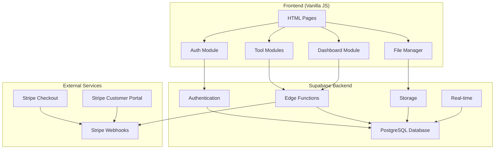
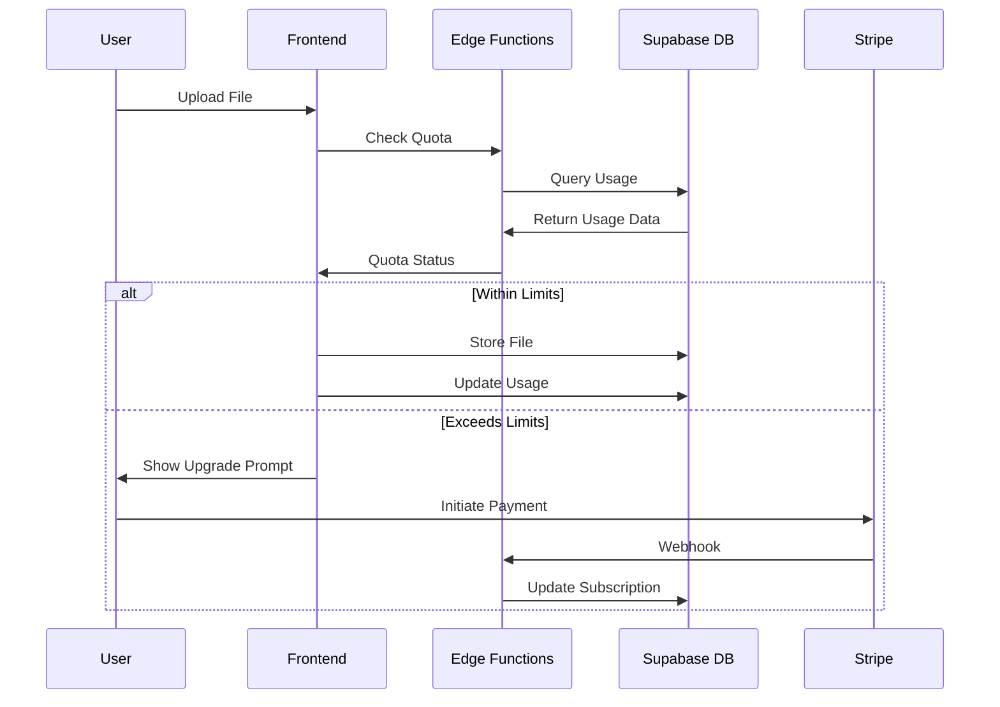

# Design Document

## Overview

This design document outlines the technical architecture for integrating Supabase as a comprehensive CMS and backend solution for the image converter app. The solution maintains the existing vanilla HTML + JavaScript frontend while adding robust user management, authentication, file storage, payment processing, and usage analytics capabilities.

The architecture is designed to operate within strict free-tier constraints (Vercel + Supabase free tiers) while providing clear upgrade paths through Stripe integration. All usage enforcement happens client-side and via Supabase Edge Functions to prevent cost overruns.

## Architecture

### High-Level System Architecture



### Data Flow Architecture



## Components and Interfaces

### 1. Authentication System

**Component:** `auth.js`
**Purpose:** Handle user authentication and session management

```javascript
class AuthManager {
  constructor() {
    this.supabase = createClient(SUPABASE_URL, SUPABASE_ANON_KEY);
    this.currentUser = null;
  }
  
  async signUp(email, password) {
    // Implement Supabase auth signup
  }
  
  async signIn(email, password) {
    // Implement Supabase auth signin
  }
  
  async signInWithProvider(provider) {
    // Google/GitHub OAuth
  }
  
  async signOut() {
    // Clear session and redirect
  }
  
  async getCurrentUser() {
    // Get current authenticated user
  }
}
```

### 2. Usage Quota Manager

**Component:** `quota-manager.js`
**Purpose:** Client-side usage tracking and enforcement with API call monitoring

```javascript
class QuotaManager {
  constructor(authManager) {
    this.auth = authManager;
    this.planLimits = {
      free: { 
        storage: 50 * 1024 * 1024, 
        conversions: 500, 
        apiCalls: 5000,
        maxFileSize: 25 * 1024 * 1024 
      },
      pro: { 
        storage: 2 * 1024 * 1024 * 1024, 
        conversions: 5000, 
        apiCalls: 50000,
        maxFileSize: 100 * 1024 * 1024 
      },
      agency: { 
        storage: 20 * 1024 * 1024 * 1024, 
        conversions: 50000, 
        apiCalls: 500000,
        maxFileSize: 250 * 1024 * 1024 
      }
    };
  }
  
  async checkStorageQuota(fileSize) {
    // Check against current usage + new file size
  }
  
  async checkConversionQuota() {
    // Check monthly conversion count
  }
  
  async checkApiCallQuota() {
    // Check monthly API call count and decrement
  }
  
  async updateUsage(type, amount) {
    // Update usage counters (storage, conversions, api_calls)
  }
  
  getUsagePercentage(type) {
    // Return usage as percentage for UI meters
  }
}
```

### 3. File Storage Manager

**Component:** `file-manager.js`
**Purpose:** Handle file uploads, storage, and management

```javascript
class FileManager {
  constructor(authManager, quotaManager) {
    this.auth = authManager;
    this.quota = quotaManager;
    this.supabase = authManager.supabase;
  }
  
  async uploadFile(file, toolType) {
    // 1. Check quota before upload
    // 2. Validate file type and size
    // 3. Upload to Supabase Storage
    // 4. Update database record
    // 5. Update usage counters
  }
  
  async deleteFile(fileId) {
    // Remove from storage and update quota
  }
  
  async listUserFiles() {
    // Get user's file list with metadata
  }
  
  async generateShareUrl(fileId, expiresIn) {
    // Create time-limited sharing URL
  }
}
```

### 4. Dashboard Interface

**Component:** `dashboard.js`
**Purpose:** User account management and usage visualization

**Dashboard Wireframe:**
```
┌─────────────────────────────────────────┐
│ Plan Badge (Free/Pro/Agency)            │
├─────────────────────────────────────────┤
│ Storage: [████████░░] 40/50 MB          │
│ Conversions: [███░░░░░░░] 150/500       │
├─────────────────────────────────────────┤
│ [Manage Subscription] (Stripe Portal)   │
└─────────────────────────────────────────┘
```

```javascript
class Dashboard {
  constructor(authManager, quotaManager) {
    this.auth = authManager;
    this.quota = quotaManager;
  }
  
  async renderUsageMeters() {
    // Display storage and conversion usage bars with WCAG 2.1 AA compliance
  }
  
  async renderPlanBadge() {
    // Show current subscription tier with proper ARIA labels
  }
  
  async renderRecentActivity() {
    // Show recent file uploads and tool usage
  }
  
  async handleManageSubscription() {
    // Redirect to Stripe Customer Portal with keyboard accessibility
  }
  
  async renderUpgradeOptions() {
    // Show pricing table with Stripe Checkout links
  }
}
```

### 5. Stripe Integration Manager

**Component:** `stripe-integration.js`
**Purpose:** Handle payment flows and subscription management

```javascript
class StripeManager {
  constructor() {
    this.stripe = Stripe(STRIPE_PUBLISHABLE_KEY);
  }
  
  async createCheckoutSession(priceId) {
    // Create Stripe Checkout session
  }
  
  async redirectToCustomerPortal() {
    // Redirect to Stripe Customer Portal
  }
  
  async handleWebhook(event) {
    // Process Stripe webhooks via Edge Function with idempotency check
    const { data: existingEvent } = await supabase
      .from('stripe_events')
      .select('id')
      .eq('event_id', event.id)
      .single();
    
    if (existingEvent) {
      return { success: true, message: 'Event already processed' };
    }
    
    // Process event and record in stripe_events table
  }
}
```

## Free-Tier Guardrails

### Plan Limits Table

| Plan | Storage | Monthly Conversions | API Calls | Max File Size |
|------|---------|-------------------|-----------|---------------|
| Free | 50 MB | 500 | 5,000 | 25 MB |
| Pro | 2 GB | 5,000 | 50,000 | 100 MB |
| Agency | 20 GB | 50,000 | 500,000 | 250 MB |

### Edge Function Constraints

- **Response Time:** Must return in < 10 seconds (Supabase free limit)
- **Bundle Size:** Target < 1 MB to minimize cold-start delays
- **Quota Enforcement:** Decrement API calls counter and block at limit
- **Error Handling:** Graceful degradation when limits exceeded

## Data Models

### Database Schema

```sql
-- Users table (managed by Supabase Auth)
-- auth.users is automatically created

-- User profiles and preferences
CREATE TABLE user_profiles (
  id UUID REFERENCES auth.users(id) PRIMARY KEY,
  subscription_plan TEXT DEFAULT 'free' CHECK (subscription_plan IN ('free', 'pro', 'agency')),
  subscription_status TEXT DEFAULT 'active' CHECK (subscription_status IN ('active', 'past_due', 'canceled')),
  stripe_customer_id TEXT UNIQUE,
  created_at TIMESTAMP WITH TIME ZONE DEFAULT NOW(),
  updated_at TIMESTAMP WITH TIME ZONE DEFAULT NOW()
);

-- Payment subscriptions
CREATE TABLE payment_subscriptions (
  id UUID DEFAULT gen_random_uuid() PRIMARY KEY,
  user_id UUID REFERENCES auth.users(id) NOT NULL,
  stripe_subscription_id TEXT UNIQUE NOT NULL,
  plan_type TEXT NOT NULL CHECK (plan_type IN ('pro', 'agency')),
  status TEXT NOT NULL CHECK (status IN ('active', 'past_due', 'canceled', 'unpaid')),
  current_period_start TIMESTAMP WITH TIME ZONE NOT NULL,
  current_period_end TIMESTAMP WITH TIME ZONE NOT NULL,
  created_at TIMESTAMP WITH TIME ZONE DEFAULT NOW(),
  updated_at TIMESTAMP WITH TIME ZONE DEFAULT NOW()
);

-- File storage tracking
CREATE TABLE user_files (
  id UUID DEFAULT gen_random_uuid() PRIMARY KEY,
  user_id UUID REFERENCES auth.users(id) NOT NULL,
  filename TEXT NOT NULL,
  file_size BIGINT NOT NULL,
  file_type TEXT NOT NULL,
  tool_type TEXT NOT NULL,
  storage_path TEXT NOT NULL,
  is_shared BOOLEAN DEFAULT FALSE,
  share_expires_at TIMESTAMP WITH TIME ZONE,
  created_at TIMESTAMP WITH TIME ZONE DEFAULT NOW(),
  updated_at TIMESTAMP WITH TIME ZONE DEFAULT NOW()
);

-- Usage analytics
CREATE TABLE usage_analytics (
  id UUID DEFAULT gen_random_uuid() PRIMARY KEY,
  user_id UUID REFERENCES auth.users(id) NOT NULL,
  tool_type TEXT NOT NULL,
  action_type TEXT NOT NULL, -- 'conversion', 'upload', 'download'
  file_size BIGINT,
  created_at TIMESTAMP WITH TIME ZONE DEFAULT NOW()
);

-- User preferences per tool
CREATE TABLE user_preferences (
  id UUID DEFAULT gen_random_uuid() PRIMARY KEY,
  user_id UUID REFERENCES auth.users(id) NOT NULL,
  tool_type TEXT NOT NULL,
  preferences JSONB NOT NULL DEFAULT '{}',
  created_at TIMESTAMP WITH TIME ZONE DEFAULT NOW(),
  updated_at TIMESTAMP WITH TIME ZONE DEFAULT NOW(),
  UNIQUE(user_id, tool_type)
);

-- Monthly usage tracking
CREATE TABLE monthly_usage (
  id UUID DEFAULT gen_random_uuid() PRIMARY KEY,
  user_id UUID REFERENCES auth.users(id) NOT NULL,
  month_year TEXT NOT NULL, -- Format: 'YYYY-MM'
  conversions_count INTEGER DEFAULT 0,
  api_calls INTEGER DEFAULT 0,
  storage_used BIGINT DEFAULT 0,
  created_at TIMESTAMP WITH TIME ZONE DEFAULT NOW(),
  updated_at TIMESTAMP WITH TIME ZONE DEFAULT NOW(),
  UNIQUE(user_id, month_year)
);

-- Stripe webhook idempotency
CREATE TABLE stripe_events (
  id UUID DEFAULT gen_random_uuid() PRIMARY KEY,
  event_id TEXT UNIQUE NOT NULL,
  event_type TEXT NOT NULL,
  processed_at TIMESTAMP WITH TIME ZONE DEFAULT NOW(),
  created_at TIMESTAMP WITH TIME ZONE DEFAULT NOW()
);
```

### Row Level Security (RLS) Policies

```sql
-- Enable RLS on all tables
ALTER TABLE user_profiles ENABLE ROW LEVEL SECURITY;
ALTER TABLE payment_subscriptions ENABLE ROW LEVEL SECURITY;
ALTER TABLE user_files ENABLE ROW LEVEL SECURITY;
ALTER TABLE usage_analytics ENABLE ROW LEVEL SECURITY;
ALTER TABLE user_preferences ENABLE ROW LEVEL SECURITY;
ALTER TABLE monthly_usage ENABLE ROW LEVEL SECURITY;

-- User profiles: Users can only access their own profile
CREATE POLICY "Users can view own profile" ON user_profiles
  FOR SELECT USING (auth.uid() = id);

CREATE POLICY "Users can update own profile" ON user_profiles
  FOR UPDATE USING (auth.uid() = id);

-- Payment subscriptions: Users can only view their own subscriptions
CREATE POLICY "Users can view own subscriptions" ON payment_subscriptions
  FOR SELECT USING (auth.uid() = user_id);

-- User files: Users can only access their own files
CREATE POLICY "Users can manage own files" ON user_files
  FOR ALL USING (auth.uid() = user_id);

-- Usage analytics: Users can only view their own analytics
CREATE POLICY "Users can view own analytics" ON usage_analytics
  FOR SELECT USING (auth.uid() = user_id);

-- User preferences: Users can manage their own preferences
CREATE POLICY "Users can manage own preferences" ON user_preferences
  FOR ALL USING (auth.uid() = user_id);

-- Monthly usage: Users can view their own usage
CREATE POLICY "Users can view own usage" ON monthly_usage
  FOR SELECT USING (auth.uid() = user_id);
```

## Error Handling

### Client-Side Error Handling

```javascript
class ErrorHandler {
  static handleQuotaExceeded(quotaType, currentUsage, limit) {
    const message = `${quotaType} limit exceeded (${currentUsage}/${limit}). Upgrade to continue.`;
    this.showUpgradeModal(message);
  }
  
  static handleAuthError(error) {
    switch (error.message) {
      case 'Invalid login credentials':
        this.showError('Invalid email or password');
        break;
      case 'Email not confirmed':
        this.showError('Please check your email and confirm your account');
        break;
      default:
        this.showError('Authentication failed. Please try again.');
    }
  }
  
  static handleFileUploadError(error) {
    if (error.message.includes('File too large')) {
      this.showError('File exceeds maximum size limit for your plan');
    } else if (error.message.includes('Storage full')) {
      this.handleQuotaExceeded('Storage', 'current', 'limit');
    } else {
      this.showError('Upload failed. Please try again.');
    }
  }
  
  static showUpgradeModal(message) {
    // Display modal with pricing options and Stripe Checkout links
  }
  
  static showError(message) {
    // Display error notification to user
  }
}
```

### Edge Function Error Handling

```typescript
// supabase/functions/quota-check/index.ts
export default async function handler(req: Request) {
  const startTime = Date.now();
  
  try {
    const { user_id, action_type, file_size } = await req.json();
    
    // Ensure response within 10 second limit
    if (Date.now() - startTime > 9000) {
      throw new Error('Function timeout approaching');
    }
    
    // Get user's current plan and usage
    const { data: profile, error: profileError } = await supabase
      .from('user_profiles')
      .select('subscription_plan')
      .eq('id', user_id)
      .single();
    
    if (profileError) {
      return new Response(
        JSON.stringify({ error: 'Failed to fetch user profile' }),
        { status: 500, headers: { 'Content-Type': 'application/json' } }
      );
    }
    
    // Check quotas and decrement API calls counter
    const quotaCheck = await checkQuotasAndDecrementApiCalls(user_id, profile.subscription_plan, action_type, file_size);
    
    if (!quotaCheck.allowed) {
      return new Response(
        JSON.stringify({ 
          error: 'Quota exceeded', 
          quota_type: quotaCheck.quota_type,
          current_usage: quotaCheck.current_usage,
          limit: quotaCheck.limit
        }),
        { status: 429, headers: { 'Content-Type': 'application/json' } }
      );
    }
    
    return new Response(
      JSON.stringify({ allowed: true }),
      { status: 200, headers: { 'Content-Type': 'application/json' } }
    );
    
  } catch (error) {
    console.error('Quota check error:', error);
    return new Response(
      JSON.stringify({ error: 'Internal server error' }),
      { status: 500, headers: { 'Content-Type': 'application/json' } }
    );
  }
}

async function checkQuotasAndDecrementApiCalls(user_id, plan, action_type, file_size) {
  // Increment API calls counter and check against limits
  const currentMonth = new Date().toISOString().slice(0, 7); // YYYY-MM
  
  const { data: usage, error } = await supabase
    .from('monthly_usage')
    .upsert({
      user_id,
      month_year: currentMonth,
      api_calls: 1
    }, {
      onConflict: 'user_id,month_year',
      ignoreDuplicates: false
    })
    .select()
    .single();
  
  // Check if API calls exceed plan limit
  const planLimits = getPlanLimits(plan);
  if (usage.api_calls > planLimits.apiCalls) {
    return {
      allowed: false,
      quota_type: 'api_calls',
      current_usage: usage.api_calls,
      limit: planLimits.apiCalls
    };
  }
  
  return { allowed: true };
}
```

## Testing Strategy

### Unit Testing

**Framework:** Jest (already configured in package.json)

```javascript
// __tests__/quota-manager.test.js
describe('QuotaManager', () => {
  let quotaManager;
  let mockAuthManager;
  
  beforeEach(() => {
    mockAuthManager = {
      getCurrentUser: jest.fn().mockResolvedValue({ id: 'test-user-id' })
    };
    quotaManager = new QuotaManager(mockAuthManager);
  });
  
  test('should check storage quota correctly', async () => {
    const fileSize = 10 * 1024 * 1024; // 10MB
    const result = await quotaManager.checkStorageQuota(fileSize);
    expect(result).toBeDefined();
  });
  
  test('should calculate usage percentage correctly', () => {
    const percentage = quotaManager.getUsagePercentage('storage');
    expect(percentage).toBeGreaterThanOrEqual(0);
    expect(percentage).toBeLessThanOrEqual(100);
  });
});
```

### Integration Testing

```javascript
// __tests__/stripe-integration.test.js
describe('Stripe Integration', () => {
  test('should handle webhook events correctly', async () => {
    const mockEvent = {
      type: 'checkout.session.completed',
      data: {
        object: {
          customer: 'cus_test123',
          subscription: 'sub_test123'
        }
      }
    };
    
    const result = await handleStripeWebhook(mockEvent);
    expect(result.success).toBe(true);
  });
});
```

### End-to-End Testing

```javascript
// __tests__/e2e/user-flow.test.js
describe('User Registration and Upgrade Flow', () => {
  test('complete user journey from signup to upgrade', async () => {
    // 1. User signs up
    // 2. User uploads files until quota is reached
    // 3. User sees upgrade prompt
    // 4. User completes Stripe checkout
    // 5. User gains premium features
  });
});
```

### Performance Testing

```javascript
// __tests__/performance/quota-check.test.js
describe('Quota Check Performance', () => {
  test('quota check should complete within 2 seconds', async () => {
    const startTime = Date.now();
    await quotaManager.checkStorageQuota(1024 * 1024);
    const endTime = Date.now();
    
    expect(endTime - startTime).toBeLessThan(2000);
  });
});
```

## Nightly Cleanup (Vercel Cron)

### Data Retention Policy

```javascript
// api/cron/cleanup.js
export default async function handler(req, res) {
  if (req.method !== 'POST') {
    return res.status(405).json({ error: 'Method not allowed' });
  }
  
  try {
    // Purge usage_analytics rows older than 90 days
    const ninetyDaysAgo = new Date();
    ninetyDaysAgo.setDate(ninetyDaysAgo.getDate() - 90);
    
    const { data, error } = await supabase
      .from('usage_analytics')
      .delete()
      .lt('created_at', ninetyDaysAgo.toISOString());
    
    if (error) throw error;
    
    return res.status(200).json({ 
      success: true, 
      message: `Cleaned up ${data?.length || 0} old analytics records` 
    });
  } catch (error) {
    console.error('Cleanup error:', error);
    return res.status(500).json({ error: 'Cleanup failed' });
  }
}
```

## Environment Variables

### Required Environment Variables

```bash
# Supabase Configuration
SUPABASE_URL=https://your-project.supabase.co
SUPABASE_ANON_KEY=your-anon-key
SUPABASE_SERVICE_ROLE=your-service-role-key

# Stripe Configuration
STRIPE_SECRET_KEY=sk_test_your-secret-key
STRIPE_PUBLISHABLE_KEY=pk_test_your-publishable-key
STRIPE_WEBHOOK_SECRET=whsec_your-webhook-secret

# Plan Limits (for easy configuration)
FREE_LIMIT_STORAGE=52428800  # 50MB in bytes
FREE_LIMIT_CONVERSIONS=500
FREE_LIMIT_API_CALLS=5000
FREE_LIMIT_MAX_FILE_SIZE=26214400  # 25MB in bytes

PRO_LIMIT_STORAGE=2147483648  # 2GB in bytes
PRO_LIMIT_CONVERSIONS=5000
PRO_LIMIT_API_CALLS=50000
PRO_LIMIT_MAX_FILE_SIZE=104857600  # 100MB in bytes

AGENCY_LIMIT_STORAGE=21474836480  # 20GB in bytes
AGENCY_LIMIT_CONVERSIONS=50000
AGENCY_LIMIT_API_CALLS=500000
AGENCY_LIMIT_MAX_FILE_SIZE=262144000  # 250MB in bytes
```

## Accessibility Baseline

### WCAG 2.1 AA Compliance Requirements

All new UI components must meet the following accessibility standards:

- **Contrast:** Minimum 4.5:1 ratio for normal text, 3:1 for large text
- **Keyboard Navigation:** All interactive elements accessible via keyboard
- **ARIA Labels:** Proper semantic markup and screen reader support
- **Focus Management:** Clear focus indicators and logical tab order
- **Color Independence:** Information not conveyed by color alone
- **Responsive Design:** Usable at 200% zoom level

### Implementation Guidelines

```javascript
// Example: Accessible usage meter component
class UsageMeter {
  render(type, current, limit) {
    const percentage = (current / limit) * 100;
    const ariaLabel = `${type} usage: ${current} of ${limit} (${percentage.toFixed(1)}%)`;
    
    return `
      <div class="usage-meter" role="progressbar" 
           aria-valuenow="${current}" 
           aria-valuemin="0" 
           aria-valuemax="${limit}"
           aria-label="${ariaLabel}">
        <div class="meter-bar" style="width: ${percentage}%"></div>
        <span class="sr-only">${ariaLabel}</span>
      </div>
    `;
  }
}
```

## Implementation Phases

### Phase 1: Core Infrastructure (Week 1-2)
- Set up Supabase project and database schema
- Implement authentication system
- Create basic user profiles and preferences
- Set up RLS policies
- Configure environment variables

### Phase 2: Usage Tracking and Quotas (Week 2-3)
- Implement quota management system with API call tracking
- Create Edge Functions for quota checking (< 10s, < 1MB bundle)
- Add usage analytics tracking
- Implement client-side quota enforcement

### Phase 3: File Storage and Management (Week 3-4)
- Set up Supabase Storage
- Implement file upload/download system
- Add file management interface
- Implement storage quota enforcement

### Phase 4: Stripe Integration (Week 4-5)
- Set up Stripe account and products
- Implement Stripe Checkout integration
- Create webhook handling system with idempotency
- Add subscription management

### Phase 5: User Dashboard (Week 5-6)
- Create accessible dashboard interface
- Implement usage visualization with WCAG 2.1 AA compliance
- Add subscription management UI
- Integrate Stripe Customer Portal

### Phase 6: Automation and Cleanup (Week 6-7)
- Set up Vercel Cron for nightly cleanup
- Implement data retention policies
- Add monitoring and alerting
- Performance optimization

### Phase 7: Testing and Documentation (Week 7-8)
- Comprehensive testing suite
- Accessibility audit
- Security audit
- Documentation completion

## Security Considerations

### Authentication Security
- Use Supabase's built-in JWT authentication
- Implement proper session management
- Add rate limiting for auth endpoints
- Use secure password requirements

### Data Protection
- All data encrypted in transit (HTTPS)
- Database encryption at rest via Supabase
- Implement proper RLS policies
- Regular security audits

### API Security
- Validate all inputs on Edge Functions
- Implement proper CORS policies
- Use API rate limiting
- Secure webhook endpoints with signature verification

### File Security
- Validate file types and sizes
- Scan uploads for malware (future enhancement)
- Implement secure file sharing with expiration
- Use signed URLs for file access