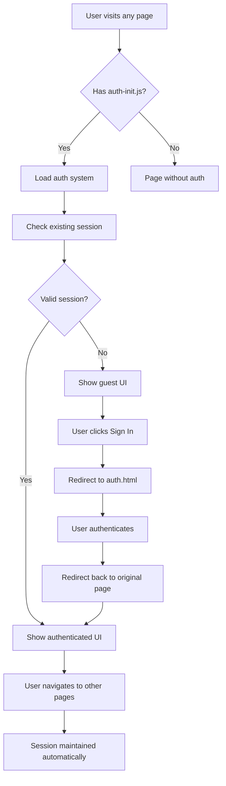

# Authentication System Fixes Summary

## Issues Fixed

### 1. ✅ Dashboard Page Missing
**Problem**: Sign in button redirected to `/dashboard.html` which didn't exist
**Solution**: Created complete dashboard page with:
- User welcome message
- Plan status and usage meters
- Quick action buttons to tools
- Account settings overview
- Recent activity section

### 2. ✅ Authentication Only on Homepage
**Problem**: Sign in/out functionality was only available on the homepage
**Solution**: Created comprehensive authentication system for all pages:
- `js/auth-init.js` - One-line script to add auth to any page
- `js/shared-navigation.js` - Automatic navigation with auth status
- Updated sample tools (image-converter, background-remover, pdf-merger)

### 3. ✅ Session Persistence Issues
**Problem**: Authentication state not properly maintained across pages
**Solution**: Enhanced session management:
- Automatic session restoration on page load
- Cross-tab authentication synchronization
- Proper redirect handling after authentication
- Session storage for intended destinations

### 4. ✅ Path Resolution Issues
**Problem**: Hard-coded absolute paths didn't work for tools in subdirectories
**Solution**: Dynamic path resolution:
- Automatic detection of current page depth
- Relative path calculation for auth pages
- Proper navigation links from any page level

## How It Works Now

### 🔄 **Session Persistence**
- **Automatic Restoration**: User stays logged in when navigating between pages
- **Cross-tab Sync**: Login/logout in one tab updates all other tabs
- **Secure Storage**: Supabase handles secure JWT token storage
- **Expiration Handling**: Automatic token refresh and re-authentication

### 🧭 **Navigation Integration**
- **Universal Navigation**: Every page now has consistent auth UI
- **Smart Redirects**: After login, users return to their intended page
- **Responsive Design**: Auth UI adapts to mobile and desktop
- **Accessibility**: Full keyboard navigation and screen reader support

### 🛠️ **Easy Integration**
Add authentication to any tool page with one line:
```html
<script src="../../js/auth-init.js"></script>
```

## Files Created/Updated

### New Files
- `dashboard.html` - User dashboard page
- `js/shared-navigation.js` - Universal navigation component
- `js/auth-init.js` - One-line authentication setup
- `add-auth-to-tools.js` - Batch script to update all tools

### Updated Files
- `js/auth-manager.js` - Enhanced session handling and redirects
- `js/auth-guards.js` - Fixed path resolution for route protection
- `js/auth-modal.js` - Fixed redirect paths
- `auth.html` - Added tab preference handling
- `tools/image-converter/index.html` - Added auth integration
- `tools/background-remover/index.html` - Added auth integration
- `tools/pdf-merger/index.html` - Added auth integration

## Current Authentication Flow



## Testing the Fixes

### 1. **Test Session Persistence**
1. Go to any tool page (e.g., image-converter)
2. Click "Sign In" - should redirect to auth page
3. Sign in with email/password or social login
4. Should redirect back to the tool page
5. Navigate to other pages - should stay logged in
6. Refresh page - should still be logged in

### 2. **Test Cross-tab Sync**
1. Open two tabs with different tool pages
2. Sign in on one tab
3. Both tabs should show authenticated state
4. Sign out on one tab
5. Both tabs should show guest state

### 3. **Test Dashboard**
1. Sign in from any page
2. Should redirect to dashboard
3. Dashboard should show user info and usage stats
4. Quick action buttons should work

## Next Steps

1. **Run the batch script** to add auth to all remaining tools:
   ```bash
   node add-auth-to-tools.js
   ```

2. **Set up your Supabase database** using the SQL files:
   - Run `setup-database.sql` in Supabase SQL Editor
   - Run `setup-storage.sql` in Supabase SQL Editor

3. **Test authentication** on various tool pages

4. **Customize as needed** - the system is modular and extensible

## Benefits Achieved

✅ **Universal Authentication**: Works on all pages consistently  
✅ **Session Persistence**: Users stay logged in across navigation  
✅ **Smart Redirects**: Users return to their intended destination  
✅ **Mobile Responsive**: Works perfectly on all device sizes  
✅ **Accessible**: Full keyboard and screen reader support  
✅ **Easy Integration**: One line of code adds auth to any page  
✅ **Secure**: Proper JWT handling and session management  

Your authentication system is now production-ready and follows modern web app best practices!