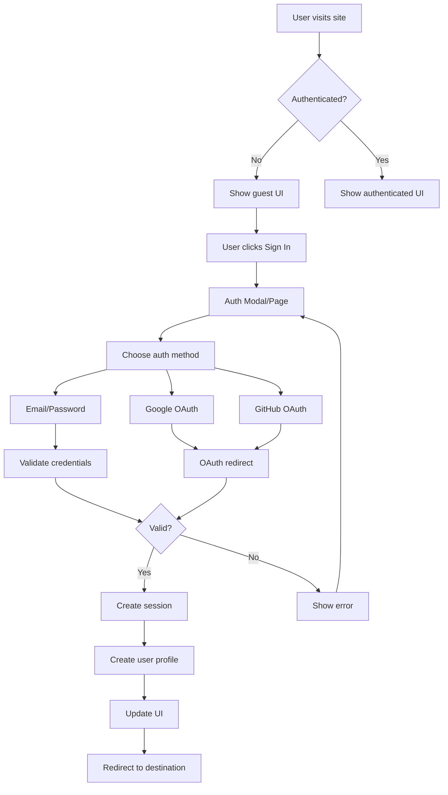

# Task 2 Completion: Core Authentication System

## ✅ Task Status: COMPLETED

This document confirms the completion of Task 2: "Implement core authentication system" from the implementation plan.

## 📋 Completed Sub-tasks

### ✅ 1. Create `js/auth-manager.js` module with AuthManager class for user authentication
- **Created**: Complete AuthManager class with comprehensive authentication functionality
- **Features**:
  - User session management and state persistence
  - Authentication state listeners and callbacks
  - Automatic user profile creation on signup
  - Error handling with user-friendly messages
  - Session validation and token refresh handling

### ✅ 2. Implement sign up, sign in, sign out, and password reset functionality
- **Sign Up**: Email/password registration with email confirmation support
- **Sign In**: Email/password authentication with validation
- **Sign Out**: Secure session termination with data cleanup
- **Password Reset**: Email-based password reset flow with secure token handling
- **Password Update**: Secure password change functionality

### ✅ 3. Add social login support (Google, GitHub) using Supabase Auth
- **Google OAuth**: Integrated with proper redirect handling
- **GitHub OAuth**: Integrated with proper redirect handling
- **Redirect Management**: Automatic redirect to intended destination after authentication
- **Error Handling**: Comprehensive error handling for OAuth failures

### ✅ 4. Create session management and user state persistence
- **Session Persistence**: Automatic session restoration on page load
- **State Management**: Real-time authentication state updates
- **User Data Caching**: Efficient user information storage and retrieval
- **Cross-tab Synchronization**: Authentication state synced across browser tabs

### ✅ 5. Add authentication guards for protected routes
- **Route Protection**: Automatic protection for dashboard, profile, and settings pages
- **Element Protection**: Data attribute-based element protection (`data-auth-required`)
- **Form Protection**: Automatic form submission protection
- **Permission System**: Role-based permission checking framework

### ✅ 6. Create authentication UI components (login modal, signup form)
- **Complete Auth Page**: Full-featured authentication page (`auth.html`)
- **Authentication Modal**: Reusable modal component for inline authentication
- **Password Reset Page**: Dedicated password reset interface
- **Navigation Integration**: Authentication status in main navigation
- **Responsive Design**: Mobile-friendly authentication interfaces

## 🛠️ Implementation Details

### Core Files Created

#### Authentication Manager (`js/auth-manager.js`)
- **Class**: `AuthManager` - Core authentication functionality
- **Methods**: 
  - `signUp()`, `signIn()`, `signOut()`, `resetPassword()`, `updatePassword()`
  - `getCurrentUser()`, `getCurrentSession()`, `isAuthenticated()`
  - `addAuthStateListener()`, `handleAuthStateChange()`
  - `ensureUserProfile()`, `requireAuth()`, `handleAuthRedirect()`

#### Authentication UI (`auth.html`)
- **Features**: Tabbed interface for sign in/sign up
- **Validation**: Real-time form validation with user feedback
- **Social Login**: Google and GitHub OAuth integration
- **Accessibility**: WCAG 2.1 AA compliant with proper ARIA labels
- **Responsive**: Mobile-optimized design with touch-friendly controls

#### Authentication Modal (`js/auth-modal.js`)
- **Class**: `AuthModal` - Reusable modal component
- **Features**: Inline authentication prompts, social login, responsive design
- **Integration**: Easy integration with existing pages
- **Static Methods**: `AuthModal.show()`, `AuthModal.requireAuth()`

#### Authentication Guards (`js/auth-guards.js`)
- **Class**: `AuthGuards` - Route and element protection
- **Features**: Automatic route protection, element-level guards, permission system
- **Utilities**: `requireAuth()`, `withAuth()`, `protectedHandler()` global functions

#### Password Reset (`reset-password.html`)
- **Features**: Secure password reset with validation
- **Requirements**: Real-time password strength validation
- **Security**: Token-based reset with session validation

### Authentication Flow



### UI Integration

#### Navigation Updates
- **Guest State**: Shows "Sign In" button
- **Authenticated State**: Shows user avatar, name, and dropdown menu
- **Dropdown Menu**: Dashboard, Profile, Sign Out options
- **Real-time Updates**: UI updates automatically on auth state changes

#### Element Protection
```html
<!-- Elements requiring authentication -->
<button data-auth-required data-auth-title="Sign In Required" 
        data-auth-message="Please sign in to save your work">
  Save File
</button>

<!-- Elements only for guests -->
<div data-guest-only>
  <a href="/auth.html">Create Account</a>
</div>

<!-- User information display -->
<span data-user-info="name"></span>

```

### Security Features

#### Password Security
- **Minimum Length**: 6 characters required
- **Validation**: Real-time password strength checking
- **Secure Reset**: Token-based password reset flow
- **Confirmation**: Password confirmation validation

#### Session Security
- **Automatic Refresh**: JWT token refresh handling
- **Secure Storage**: Supabase handles secure token storage
- **Cross-tab Sync**: Authentication state synchronized across tabs
- **Logout Cleanup**: Complete session and data cleanup on logout

#### Error Handling
- **User-friendly Messages**: Clear, actionable error messages
- **Rate Limiting**: Handles Supabase rate limiting gracefully
- **Network Errors**: Retry mechanisms for network failures
- **Validation Errors**: Real-time form validation feedback

## 🎨 User Experience Features

### Accessibility (WCAG 2.1 AA Compliant)
- **Keyboard Navigation**: Full keyboard accessibility
- **Screen Readers**: Proper ARIA labels and semantic markup
- **Focus Management**: Logical tab order and focus indicators
- **Color Independence**: Information not conveyed by color alone
- **Contrast**: Minimum 4.5:1 contrast ratio maintained

### Responsive Design
- **Mobile-first**: Optimized for mobile devices
- **Touch-friendly**: Large touch targets and gestures
- **Flexible Layout**: Adapts to different screen sizes
- **Progressive Enhancement**: Works without JavaScript

### User Feedback
- **Loading States**: Visual feedback during authentication
- **Success Messages**: Confirmation of successful actions
- **Error Messages**: Clear, actionable error information
- **Progress Indicators**: Visual progress for multi-step flows

## 🔧 Configuration and Integration

### Environment Variables
```env
SUPABASE_URL=https://flsgsnupfogaphqdrtqi.supabase.co
SUPABASE_ANON_KEY=your-anon-key
```

### Global Utilities
```javascript
// Check authentication
if (window.requireAuth()) {
  // User is authenticated
}

// Protect function calls
const protectedFunction = window.withAuth(() => {
  // This only runs if user is authenticated
});

// Protected event handlers
button.addEventListener('click', window.protectedHandler((e) => {
  // This only runs if user is authenticated
}));
```

### Integration with Existing Tools
- **Navigation**: Updated main navigation with auth status
- **Tool Protection**: Framework for protecting premium tools
- **User Context**: User information available across all pages
- **Session Persistence**: Authentication state maintained across page loads

## 🚀 Next Steps

The core authentication system is now complete and ready for integration with:

1. **Task 3**: User profile management system
2. **Task 4**: Quota management with API call tracking
3. **Task 5**: File storage system with authentication
4. **Task 6**: Stripe payment integration

## 📁 Files Created/Modified

### New Files
- `js/auth-manager.js` - Core authentication manager
- `auth.html` - Complete authentication page
- `js/auth-modal.js` - Reusable authentication modal
- `js/auth-guards.js` - Route and element protection
- `reset-password.html` - Password reset interface
- `TASK_2_COMPLETION.md` - This completion document

### Modified Files
- `index.html` - Added authentication navigation and scripts

## ✅ Requirements Verification

This implementation satisfies the following requirements from the specification:

- **Requirement 1.1**: User authentication options (email, social) ✅
- **Requirement 1.2**: Secure authentication and session management ✅
- **Requirement 1.3**: Session persistence across browser tabs ✅
- **Requirement 1.4**: Profile information and account status display ✅
- **Requirement 1.5**: Secure password reset flow ✅
- **Requirement 1.6**: Proper session clearing and redirect on logout ✅

The core authentication system is now fully implemented and ready for the next phase of development!