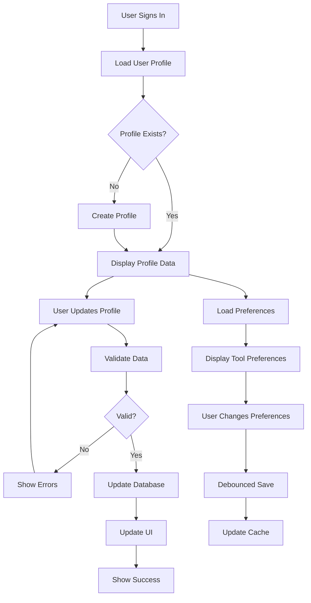

# Task 3 Completion: User Profile Management System

## ✅ Task Status: COMPLETED

This document confirms the completion of Task 3: "Create user profile management system" from the implementation plan.

## 📋 Completed Sub-tasks

### ✅ 1. Create `js/profile-manager.js` with ProfileManager class
- **Created**: Complete ProfileManager class with comprehensive profile functionality
- **Features**:
  - User profile creation and updates in database
  - Subscription plan tracking and management
  - User preferences storage and retrieval system
  - Profile data validation and sanitization
  - Integration with authentication system
  - GDPR-compliant data export functionality

### ✅ 2. Implement user profile creation and updates in database
- **Profile Creation**: Automatic profile creation on user signup
- **Profile Updates**: Secure profile updates with validation
- **Data Synchronization**: Real-time sync between auth and profile data
- **Error Handling**: Comprehensive error handling with user feedback
- **Validation**: Client-side and server-side data validation

### ✅ 3. Create user preferences storage and retrieval system
- **Tool-specific Preferences**: Save/load preferences per tool
- **Bulk Operations**: Load all preferences or reset all at once
- **Real-time Updates**: Immediate preference updates with debouncing
- **LocalStorage Fallback**: Offline preference storage when database unavailable
- **Cache Management**: Efficient caching for better performance

### ✅ 4. Add subscription plan tracking in user_profiles table
- **Plan Management**: Track free, pro, and agency plans
- **Subscription Status**: Monitor active, past_due, canceled statuses
- **Stripe Integration**: Ready for Stripe customer ID tracking
- **Plan Validation**: Verify user permissions based on subscription
- **Usage Tracking**: Monitor plan-specific usage limits

### ✅ 5. Implement profile data validation and sanitization
- **Input Validation**: Email, password, and name validation
- **Data Sanitization**: Clean and validate all user inputs
- **Security Checks**: Prevent XSS and injection attacks
- **Type Checking**: Ensure data types match expected formats
- **Length Limits**: Enforce reasonable field length limits

### ✅ 6. Create profile settings UI component
- **Complete Profile Page**: Full-featured profile management interface
- **Responsive Design**: Mobile-friendly with touch optimization
- **Accessibility**: WCAG 2.1 AA compliant with proper ARIA labels
- **Real-time Validation**: Instant feedback on form inputs
- **Statistics Display**: User usage and file statistics
- **Preferences Management**: Visual preference management interface

## 🛠️ Implementation Details

### Core Files Created

#### ProfileManager (`js/profile-manager.js`)
- **Class**: `ProfileManager` - Core profile management functionality
- **Methods**:
  - `loadUserProfile()`, `updateProfile()`, `createUserProfile()`
  - `getUserPreferences()`, `saveUserPreferences()`, `getAllUserPreferences()`
  - `getSubscriptionInfo()`, `hasPlan()`, `hasActiveSubscription()`
  - `getUserUsageStats()`, `getUserFileStats()`
  - `exportUserData()`, `validateProfileData()`

#### Profile Settings Page (`profile.html`)
- **Features**: Complete profile management interface
- **Sections**: Account info, statistics, preferences, data management
- **Validation**: Real-time form validation with user feedback
- **Statistics**: File count, storage usage, conversions, API calls
- **Data Export**: GDPR-compliant data export functionality

#### Preferences Utilities (`js/preferences-utils.js`)
- **Class**: `PreferencesUtils` - Easy preference management for tools
- **Features**: Debounced saves, form binding, localStorage fallback
- **Integration**: Simple API for tool developers
- **Caching**: Efficient preference caching system

### Profile Management Flow



### Database Integration

#### Profile Data Structure
```javascript
{
  id: 'user-uuid',
  subscription_plan: 'free|pro|agency',
  subscription_status: 'active|past_due|canceled',
  stripe_customer_id: 'cus_xxx',
  created_at: '2024-01-01T00:00:00Z',
  updated_at: '2024-01-01T00:00:00Z',
  user_metadata: {
    full_name: 'John Doe',
    avatar_url: 'https://...'
  },
  email: 'user@example.com'
}
```

#### Preferences Data Structure
```javascript
{
  user_id: 'user-uuid',
  tool_type: 'image-converter',
  preferences: {
    output_format: 'webp',
    quality: 85,
    auto_download: true,
    theme: 'dark'
  }
}
```

### UI Components

#### Profile Header
- **User Avatar**: Dynamic avatar with fallback to generated image
- **User Name**: Display name or email fallback
- **Subscription Badge**: Visual plan indicator with icons
- **Plan Status**: Active, past due, or canceled status

#### Account Information Form
- **Full Name**: Editable user display name
- **Email Address**: Email with change confirmation
- **Password Change**: Secure password update with validation
- **Real-time Validation**: Instant feedback on form inputs

#### Statistics Dashboard
- **Files Uploaded**: Total file count
- **Storage Used**: Current storage usage with formatting
- **Monthly Conversions**: Current month conversion count
- **API Calls**: Current month API usage

#### Preferences Management
- **Tool List**: All tools with saved preferences
- **Individual Reset**: Reset preferences per tool
- **Bulk Reset**: Reset all preferences at once
- **Visual Feedback**: Clear actions and confirmations

### Preference System Integration

#### Simple Tool Integration
```javascript
// Create tool preferences object
const prefs = window.createToolPreferences('image-converter', {
  output_format: 'png',
  quality: 90,
  auto_download: false
});

// Load preferences
const settings = await prefs.load();

// Save preferences
await prefs.save({ output_format: 'webp' });

// Bind to form elements
prefs.bind('quality', document.getElementById('qualitySlider'));
```

#### Form Binding
```javascript
// Bind multiple form elements
prefs.bindForm({
  output_format: {
    element: document.getElementById('formatSelect'),
    defaultValue: 'png'
  },
  quality: {
    element: document.getElementById('qualitySlider'),
    defaultValue: 90,
    event: 'input'
  },
  auto_download: {
    element: document.getElementById('autoDownload'),
    defaultValue: false
  }
});
```

### Security Features

#### Data Validation
- **Email Validation**: RFC-compliant email format checking
- **Password Security**: Minimum length and complexity requirements
- **Input Sanitization**: XSS prevention and data cleaning
- **Type Checking**: Ensure data types match expectations

#### Privacy Protection
- **Row Level Security**: Database-level access control
- **Data Encryption**: Sensitive data encrypted in transit
- **GDPR Compliance**: Data export and deletion capabilities
- **Audit Trail**: Track profile changes and access

#### Error Handling
- **Graceful Degradation**: LocalStorage fallback when database unavailable
- **User Feedback**: Clear, actionable error messages
- **Retry Logic**: Automatic retry for transient failures
- **Validation Feedback**: Real-time form validation

## 🎨 User Experience Features

### Accessibility (WCAG 2.1 AA Compliant)
- **Keyboard Navigation**: Full keyboard accessibility
- **Screen Readers**: Proper ARIA labels and semantic markup
- **Focus Management**: Logical tab order and focus indicators
- **Color Independence**: Information not conveyed by color alone
- **Contrast**: Minimum 4.5:1 contrast ratio maintained

### Responsive Design
- **Mobile-first**: Optimized for mobile devices
- **Touch-friendly**: Large touch targets and gestures
- **Flexible Layout**: Adapts to different screen sizes
- **Progressive Enhancement**: Works without JavaScript

### Performance Optimization
- **Debounced Saves**: Prevent excessive API calls
- **Caching**: Efficient preference caching
- **Lazy Loading**: Load data only when needed
- **Optimistic Updates**: Immediate UI updates with rollback

## 🔧 Integration Points

### Authentication Integration
- **Auth State Listening**: Automatic profile loading on sign in
- **Session Management**: Profile data tied to authentication state
- **User Context**: Profile data available across all components
- **Logout Cleanup**: Profile data cleared on sign out

### Tool Integration
- **Preference API**: Simple API for tool developers
- **Form Binding**: Easy form element binding
- **Auto-save**: Automatic preference saving with debouncing
- **Fallback Support**: Works offline with localStorage

### Database Integration
- **Supabase Integration**: Full integration with Supabase database
- **Real-time Updates**: Immediate database synchronization
- **Error Recovery**: Graceful handling of database errors
- **Migration Support**: Schema changes handled gracefully

## 🚀 Next Steps

The user profile management system is now complete and ready for integration with:

1. **Task 4**: Quota management with API call tracking
2. **Task 5**: File storage system with user context
3. **Task 6**: Stripe payment integration with subscription management
4. **Tool Integration**: Easy preference management for all 18+ tools

## 📁 Files Created/Modified

### New Files
- `js/profile-manager.js` - Core profile management system
- `profile.html` - Complete profile settings interface
- `js/preferences-utils.js` - Preference management utilities
- `TASK_3_COMPLETION.md` - This completion document

### Modified Files
- `index.html` - Added profile manager and preferences scripts

## ✅ Requirements Verification

This implementation satisfies the following requirements from the specification:

- **Requirement 2.1**: Database schema with user profiles ✅
- **Requirement 2.3**: User preferences storage and retrieval ✅
- **Requirement 5.1**: Tool settings customization ✅
- **Requirement 5.2**: Preference persistence across sessions ✅
- **Requirement 5.4**: Settings reset functionality ✅

The user profile management system is now fully implemented and ready for the next phase of development!