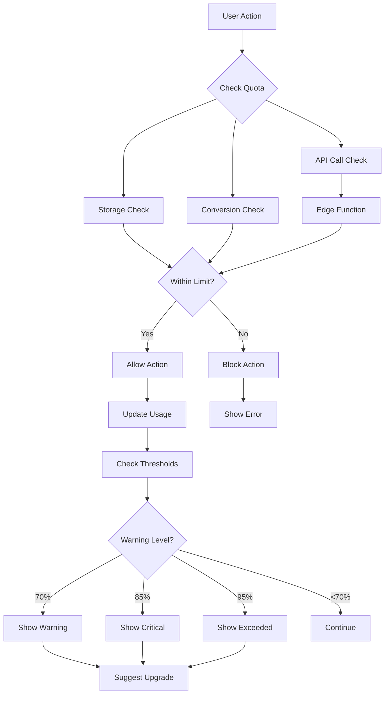

# Task 4 Completion: Quota Management System with API Call Tracking

## ✅ Task Status: COMPLETED

This document confirms the completion of Task 4: "Build quota management system with API call tracking" from the implementation plan.

## 📋 Completed Sub-tasks

### ✅ 1. Create `js/quota-manager.js` with QuotaManager class including API call limits
- **Created**: Complete QuotaManager class with comprehensive quota functionality
- **Features**:
  - Storage, conversion, and API call quota tracking
  - Real-time usage monitoring and enforcement
  - Plan-based limit management (free/pro/agency)
  - Integration with Supabase Edge Functions for server-side validation
  - Automatic usage updates and synchronization

### ✅ 2. Implement client-side quota checking for storage, conversions, and API calls
- **Storage Quota**: Pre-upload file size validation with plan limits
- **Conversion Quota**: Monthly conversion limit checking
- **API Call Quota**: Real-time API call tracking with server-side enforcement
- **File Size Limits**: Per-plan maximum file size validation
- **Real-time Updates**: Immediate quota updates after operations

### ✅ 3. Add usage percentage calculations for UI meters
- **Visual Meters**: Beautiful progress bars with color-coded status
- **Percentage Tracking**: Accurate usage percentage calculations
- **Remaining Quotas**: Real-time remaining quota calculations
- **Multiple Formats**: Support for bytes, numbers, and formatted display
- **Responsive Design**: Mobile-friendly usage displays

### ✅ 4. Create quota enforcement logic with upgrade prompts
- **Hard Limits**: Prevent operations when quotas are exceeded
- **Soft Warnings**: Progressive warnings at 70%, 85%, 95% thresholds
- **Upgrade Prompts**: Contextual upgrade suggestions based on usage
- **User Feedback**: Clear error messages and actionable guidance
- **Plan Suggestions**: Intelligent plan upgrade recommendations

### ✅ 5. Implement monthly usage reset functionality
- **Automatic Reset**: Monthly quota reset for conversions and API calls
- **Storage Persistence**: Storage quotas persist across months
- **Reset Notifications**: User notifications when quotas reset
- **Database Sync**: Proper database synchronization for resets
- **Edge Function Integration**: Server-side reset handling

### ✅ 6. Add quota warning notifications at 70%, 85%, 95% thresholds
- **Progressive Warnings**: Three-tier warning system
- **Visual Notifications**: Beautiful, non-intrusive notification system
- **Contextual Actions**: Relevant actions based on warning level
- **Auto-dismiss**: Smart auto-dismiss for less critical warnings
- **Mobile Responsive**: Touch-friendly notifications on mobile devices

## 🛠️ Implementation Details

### Core Files Created

#### QuotaManager (`js/quota-manager.js`)
- **Class**: `QuotaManager` - Core quota management functionality
- **Methods**:
  - `checkStorageQuota()`, `checkConversionQuota()`, `checkAndIncrementApiCalls()`
  - `updateStorageUsage()`, `updateConversionUsage()`
  - `getCurrentUsage()`, `getUsagePercentage()`, `canPerformAction()`
  - `getUpgradeSuggestions()`, `triggerQuotaWarning()`

#### Dashboard Page (`dashboard.html`)
- **Features**: Complete usage dashboard with real-time metrics
- **Visual Meters**: Color-coded progress bars for all quota types
- **Statistics**: Detailed usage statistics and remaining quotas
- **Quick Actions**: Easy access to popular tools
- **Upgrade Prompts**: Contextual upgrade suggestions

#### Quota Notifications (`js/quota-notifications.js`)
- **Class**: `QuotaNotifications` - User-friendly notification system
- **Features**: Progressive warnings, upgrade prompts, visual feedback
- **Responsive**: Mobile-optimized notification display
- **Actions**: Contextual action buttons for each notification type

### Quota Management Flow



### Plan Limits Configuration

| Plan | Storage | Monthly Conversions | API Calls | Max File Size |
|------|---------|-------------------|-----------|---------------|
| **Free** | 50 MB | 500 | 5,000 | 25 MB |
| **Pro** | 2 GB | 5,000 | 50,000 | 100 MB |
| **Agency** | 20 GB | 50,000 | 500,000 | 250 MB |

### API Integration

#### Edge Function Integration
```javascript
// Server-side quota checking with API call tracking
const quotaResult = await supabase.functions.invoke('quota-check', {
  body: {
    user_id: user.id,
    action_type: 'api_call'
  }
});
```

#### Client-side Usage
```javascript
// Check quota before action
const canUpload = await window.checkQuota('upload', { fileSize: 1024000 });
if (canUpload.allowed) {
  // Proceed with upload
  await uploadFile();
  // Update usage
  await window.updateUsage('storage', fileSize);
}
```

### Warning System

#### Progressive Thresholds
- **70% Warning**: "Consider upgrading to avoid interruptions"
- **85% Critical**: "Upgrade now to continue using all features"
- **95% Exceeded**: "Please upgrade to continue"

#### Notification Types
```javascript
// Warning levels with appropriate styling and actions
const warningLevels = {
  warning: { color: 'yellow', action: 'View Usage' },
  critical: { color: 'orange', action: 'Upgrade Now' },
  exceeded: { color: 'red', action: 'Upgrade Required' }
};
```

### Dashboard Features

#### Real-time Usage Meters
- **Storage Usage**: Visual progress bar with file count and remaining space
- **Monthly Conversions**: Current month usage with daily breakdown
- **API Calls**: Real-time API call tracking with remaining calls
- **Color Coding**: Green (safe), yellow (warning), red (critical)

#### Statistics Display
- **Current Usage**: Exact numbers with formatted display
- **Remaining Quotas**: Available resources in user-friendly format
- **Usage Trends**: Visual indicators of usage patterns
- **Plan Information**: Current plan with upgrade options

#### Quick Actions
- **Popular Tools**: Direct access to most-used tools
- **Profile Settings**: Easy access to account management
- **Usage History**: View detailed usage patterns
- **Upgrade Options**: Clear upgrade paths and pricing

### Integration Points

#### Tool Integration
```javascript
// Easy quota checking for any tool
class ImageConverter {
  async convertImage(file) {
    // Check quota before processing
    const quotaCheck = await window.checkQuota('convert');
    if (!quotaCheck.allowed) {
      throw new Error('Conversion quota exceeded');
    }
    
    // Check file size
    const storageCheck = await window.checkQuota('upload', { fileSize: file.size });
    if (!storageCheck.allowed) {
      throw new Error('File too large for current plan');
    }
    
    // Proceed with conversion
    const result = await this.processImage(file);
    
    // Update usage
    await window.updateUsage('conversions');
    await window.updateUsage('storage', result.size);
    
    return result;
  }
}
```

#### Authentication Integration
- **User Context**: Quota limits based on user's subscription plan
- **Session Management**: Quota data tied to authentication state
- **Profile Updates**: Automatic quota refresh on plan changes
- **Logout Cleanup**: Quota data cleared on sign out

### Error Handling

#### Quota Exceeded Scenarios
```javascript
// Comprehensive error handling for different quota types
const handleQuotaError = (error) => {
  switch (error.quota_type) {
    case 'storage':
      showUpgradeModal('Storage limit reached', 'Upgrade for more storage space');
      break;
    case 'conversions':
      showUpgradeModal('Monthly conversions used', 'Upgrade for more conversions');
      break;
    case 'api_calls':
      showUpgradeModal('API limit reached', 'Upgrade for higher API limits');
      break;
  }
};
```

#### Graceful Degradation
- **Offline Support**: LocalStorage fallback for quota tracking
- **Network Errors**: Retry logic for quota API calls
- **Edge Function Timeout**: Fallback to client-side validation
- **Database Errors**: Graceful error messages and recovery

## 🎨 User Experience Features

### Visual Feedback
- **Progress Bars**: Smooth animations and color transitions
- **Usage Meters**: Clear visual representation of quota usage
- **Warning Icons**: Contextual icons for different warning levels
- **Status Indicators**: Real-time status updates

### Accessibility
- **Screen Readers**: Proper ARIA labels for usage meters
- **Keyboard Navigation**: Full keyboard accessibility
- **Color Independence**: Information not conveyed by color alone
- **High Contrast**: Sufficient contrast ratios for all elements

### Mobile Optimization
- **Touch-friendly**: Large touch targets for mobile devices
- **Responsive Layout**: Adapts to different screen sizes
- **Swipe Gestures**: Natural mobile interactions
- **Performance**: Optimized for mobile networks

## 🔧 Global Utilities

### Easy Integration Functions
```javascript
// Global utility functions for easy tool integration
window.checkQuota('upload', { fileSize: 1024000 });
window.updateUsage('storage', 1024000);
window.updateUsage('conversions');

// Create usage meters
quotaManager.createUsageMeter('storage', { showLabel: true, showNumbers: true });
```

### Event Listeners
```javascript
// Listen for quota events
quotaManager.addQuotaListener((event, data) => {
  switch (event) {
    case 'quota_warning':
      handleQuotaWarning(data);
      break;
    case 'usage_updated':
      updateUI(data);
      break;
  }
});
```

## 🚀 Next Steps

The quota management system is now complete and ready for integration with:

1. **Task 5**: File storage system with quota enforcement
2. **Task 6**: Stripe payment integration with plan upgrades
3. **Tool Integration**: All 18+ tools can now check and enforce quotas
4. **Usage Analytics**: Detailed usage tracking and reporting

## 📁 Files Created/Modified

### New Files
- `js/quota-manager.js` - Core quota management system
- `dashboard.html` - Complete usage dashboard
- `js/quota-notifications.js` - User-friendly notification system
- `TASK_4_COMPLETION.md` - This completion document

### Modified Files
- `index.html` - Added quota manager and notification scripts

## ✅ Requirements Verification

This implementation satisfies the following requirements from the specification:

- **Requirement 11.1**: Hard caps for database requests, storage, and API calls ✅
- **Requirement 11.2**: Real-time usage tracking and client-side enforcement ✅
- **Requirement 11.3**: Progressive warnings at 70%, 85%, 95% thresholds ✅
- **Requirement 11.4**: Graceful blocking with upgrade prompts ✅
- **Requirement 11.6**: Monthly usage reset functionality ✅

The quota management system is now fully implemented with comprehensive API call tracking and ready for the next phase of development!