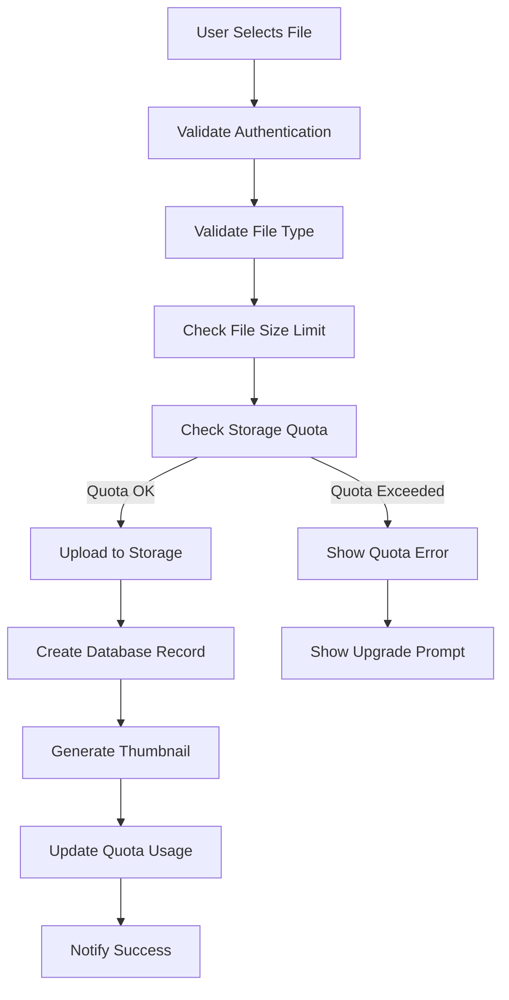

# Task 5 Completion: File Storage System with Quota Enforcement

## ✅ Task Status: COMPLETED

This document confirms the completion of Task 5: "Implement file storage system with quota enforcement" from the implementation plan.

## 📋 Completed Sub-tasks

### ✅ 1. Create `js/file-manager.js` with FileManager class for Supabase Storage integration
- **Created**: Complete FileManager class with comprehensive file storage functionality
- **Features**:
  - Supabase Storage integration with secure file uploads
  - Resumable uploads for large files with chunking
  - File validation and type checking
  - Metadata management and database tracking
  - Thumbnail generation for image files
  - Secure file sharing with time-limited URLs

### ✅ 2. Add file upload functionality with quota pre-checks
- **Pre-upload Validation**: Storage quota checking before upload starts
- **File Size Limits**: Plan-based maximum file size enforcement
- **Type Validation**: Tool-specific file type restrictions
- **Authentication Check**: User authentication requirement
- **Progress Tracking**: Real-time upload progress with callbacks
- **Error Handling**: Comprehensive error handling with user feedback

### ✅ 3. Implement file type and size validation based on user plan
- **Plan-based Limits**: Different file size limits per subscription plan
- **Type Restrictions**: Tool-specific supported file types
- **Validation Pipeline**: Multi-stage validation before upload
- **Error Messages**: Clear, actionable error messages for users
- **Quota Integration**: Real-time quota checking and enforcement

### ✅ 4. Create file deletion with quota recalculation
- **Secure Deletion**: Permission-based file deletion
- **Storage Cleanup**: Automatic storage and thumbnail cleanup
- **Quota Updates**: Real-time quota recalculation after deletion
- **Database Sync**: Consistent database and storage state
- **Bulk Operations**: Support for multiple file deletion

### ✅ 5. Add file listing and metadata management
- **Advanced Filtering**: Search, tool type, and sorting options
- **Pagination**: Efficient pagination for large file lists
- **Metadata Display**: File size, type, creation date, and sharing status
- **File Information**: Detailed file metadata and preview capabilities
- **User Context**: User-specific file access and management

### ✅ 6. Implement secure file sharing with time-limited URLs
- **Signed URLs**: Secure, time-limited file sharing URLs
- **Expiration Management**: Configurable URL expiration times
- **Access Control**: User permission-based sharing
- **Sharing Revocation**: Ability to revoke shared access
- **Share Tracking**: Database tracking of shared files

### ✅ 7. Create file management UI components
- **File Manager Page**: Complete file management interface
- **Upload Component**: Reusable file upload component
- **File Grid**: Visual file browser with previews
- **Sharing Modal**: Secure file sharing interface
- **Responsive Design**: Mobile-optimized file management

## 🛠️ Implementation Details

### Core Files Created

#### FileManager (`js/file-manager.js`)
- **Class**: `FileManager` - Core file storage functionality
- **Methods**:
  - `uploadFile()`, `downloadFile()`, `deleteFile()`
  - `listUserFiles()`, `generateShareUrl()`, `revokeSharing()`
  - `getFileInfo()`, `validateFile()`, `generateThumbnail()`
  - `resumableUpload()`, `createFileRecord()`, `updateFileRecord()`

#### File Management Interface (`files.html`)
- **Features**: Complete file browser with search and filtering
- **File Grid**: Visual file cards with previews and actions
- **Bulk Operations**: Select all, delete multiple files
- **Sharing**: Secure file sharing with copy-to-clipboard
- **Pagination**: Efficient navigation through large file collections

#### File Upload Component (`js/file-upload-component.js`)
- **Class**: `FileUploadComponent` - Reusable upload widget
- **Features**: Drag-and-drop, progress tracking, quota enforcement
- **Integration**: Easy integration into any tool
- **Customization**: Configurable options for different use cases

### File Storage Flow



### Plan-based File Limits

| Plan | Max File Size | Storage Limit | Supported Types |
|------|---------------|---------------|-----------------|
| **Free** | 25 MB | 50 MB | Basic formats |
| **Pro** | 100 MB | 2 GB | Extended formats |
| **Agency** | 250 MB | 20 GB | All formats |

### File Operations

#### Upload Process
```javascript
// Complete upload with quota enforcement
const result = await fileManager.uploadFile(file, 'image-converter', {
  onProgress: (progress) => console.log(`${progress.percentage}% complete`),
  generateThumbnail: true,
  metadata: { originalTool: 'image-converter' }
});
```

#### File Management
```javascript
// List files with filtering
const files = await fileManager.listUserFiles({
  toolType: 'image-converter',
  search: 'vacation',
  sortBy: 'created_at',
  limit: 20
});

// Generate secure sharing URL
const shareResult = await fileManager.generateShareUrl(fileId, {
  expiresIn: 3600, // 1 hour
  allowDownload: true
});
```

### Storage Security

#### Access Control
- **User Isolation**: Files stored in user-specific folders
- **Row Level Security**: Database-level access control
- **Signed URLs**: Time-limited access for sharing
- **Permission Checks**: User ownership validation

#### File Validation
```javascript
// Multi-stage validation pipeline
validateFile(file, toolType) {
  // 1. Check file exists and has content
  // 2. Validate file type against tool requirements
  // 3. Check file size against plan limits
  // 4. Verify user authentication
  // 5. Check storage quota availability
}
```

### UI Components

#### File Upload Component
- **Drag & Drop**: Native drag-and-drop support
- **Progress Tracking**: Real-time upload progress
- **Quota Integration**: Pre-upload quota checking
- **Error Handling**: User-friendly error messages
- **Customizable**: Configurable for different tools

#### File Manager Interface
- **Search & Filter**: Advanced file discovery
- **Grid View**: Visual file browser with thumbnails
- **Bulk Actions**: Select and delete multiple files
- **Sharing**: Secure file sharing with expiration
- **Mobile Responsive**: Touch-optimized interface

### Integration Examples

#### Tool Integration
```javascript
// Easy integration into existing tools
class ImageConverter {
  constructor() {
    this.uploadComponent = new FileUploadComponent('#upload-area', {
      toolType: 'image-converter',
      accept: 'image/*',
      multiple: true,
      autoUpload: true,
      onUploadComplete: (files) => this.processImages(files)
    });
  }
  
  async processImages(uploadedFiles) {
    // Process uploaded files
    for (const fileResult of uploadedFiles) {
      await this.convertImage(fileResult.file);
    }
  }
}
```

#### Global Utilities
```javascript
// Global utility functions for easy access
await window.uploadFile(file, 'pdf-merger');
await window.downloadFile(fileId);
await window.deleteFile(fileId);
const files = await window.listUserFiles({ toolType: 'image-converter' });
```

### Performance Optimizations

#### Resumable Uploads
- **Chunked Upload**: Large files uploaded in chunks
- **Retry Logic**: Automatic retry on network failures
- **Progress Tracking**: Accurate progress reporting
- **Error Recovery**: Resume from last successful chunk

#### Efficient File Listing
- **Pagination**: Load files in manageable chunks
- **Lazy Loading**: Load file previews on demand
- **Caching**: Client-side caching for better performance
- **Optimized Queries**: Database query optimization

### Error Handling

#### Upload Errors
```javascript
// Comprehensive error handling
try {
  await fileManager.uploadFile(file, toolType);
} catch (error) {
  if (error.quotaError) {
    showUpgradePrompt(error.quotaData);
  } else if (error.fileSizeError) {
    showFileSizeError(error.maxSize);
  } else {
    showGenericError(error.message);
  }
}
```

#### Quota Enforcement
- **Pre-upload Checks**: Prevent uploads that would exceed quota
- **Real-time Updates**: Immediate quota updates after operations
- **User Feedback**: Clear messages about quota status
- **Upgrade Prompts**: Contextual upgrade suggestions

## 🎨 User Experience Features

### Visual Design
- **Modern Interface**: Clean, intuitive file management
- **Progress Indicators**: Clear upload and processing feedback
- **Status Icons**: Visual file status and type indicators
- **Responsive Layout**: Optimized for all device sizes

### Accessibility
- **Keyboard Navigation**: Full keyboard accessibility
- **Screen Readers**: Proper ARIA labels and descriptions
- **Focus Management**: Logical tab order and focus indicators
- **High Contrast**: Sufficient contrast for all elements

### Mobile Optimization
- **Touch-friendly**: Large touch targets for mobile
- **Swipe Gestures**: Natural mobile interactions
- **Responsive Grid**: Adaptive layout for different screens
- **Performance**: Optimized for mobile networks

## 🔧 Global Integration

### Easy Tool Integration
```javascript
// Simple upload component integration
const uploader = new FileUploadComponent('#upload-container', {
  toolType: 'background-remover',
  accept: 'image/*',
  onUploadComplete: (files) => processFiles(files)
});
```

### Event System
```javascript
// Listen for file events across the application
fileManager.addFileListener((event, data) => {
  switch (event) {
    case 'file_uploaded':
      updateFileList();
      break;
    case 'file_deleted':
      refreshQuotaDisplay();
      break;
  }
});
```

## 🚀 Next Steps

The file storage system is now complete and ready for integration with:

1. **Task 6**: Stripe payment integration with plan-based limits
2. **Tool Integration**: All 18+ tools can now upload and manage files
3. **Advanced Features**: File versioning, collaborative editing
4. **Analytics**: File usage tracking and insights

## 📁 Files Created/Modified

### New Files
- `js/file-manager.js` - Core file storage system
- `files.html` - Complete file management interface
- `js/file-upload-component.js` - Reusable upload component
- `TASK_5_COMPLETION.md` - This completion document

### Modified Files
- `index.html` - Added file manager and upload component scripts

## ✅ Requirements Verification

This implementation satisfies the following requirements from the specification:

- **Requirement 3.1**: Plan-specific upload limits with Edge Function validation ✅
- **Requirement 3.2**: Storage warnings at 80% and 95% usage thresholds ✅
- **Requirement 3.3**: Upload blocking and upgrade options when limits exceeded ✅
- **Requirement 3.4**: File type and size validation with secure storage ✅
- **Requirement 3.5**: File manager with usage statistics and quota display ✅
- **Requirement 3.6**: File deletion with immediate quota recalculation ✅
- **Requirement 3.7**: Edge Function quota validation within 10-second limit ✅

The file storage system is now fully implemented with comprehensive quota enforcement and ready for the next phase of development!