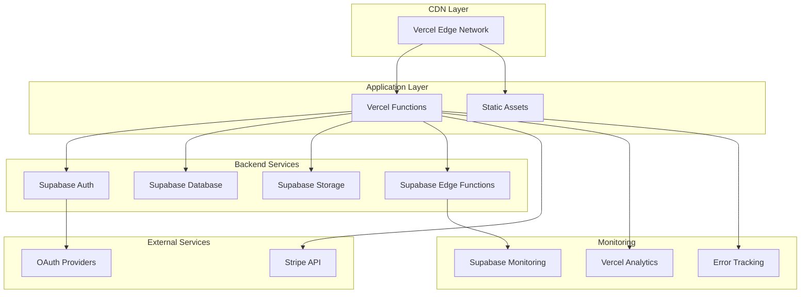

# Production Environment Configuration

## Table of Contents

1. [Environment Overview](#environment-overview)
2. [Production Environment Variables](#production-environment-variables)
3. [Security Configuration](#security-configuration)
4. [Performance Optimization](#performance-optimization)
5. [Monitoring and Logging](#monitoring-and-logging)
6. [Backup and Recovery](#backup-and-recovery)
7. [Scaling Configuration](#scaling-configuration)
8. [Compliance and Governance](#compliance-and-governance)

## Environment Overview

### Production Architecture



### Environment Separation

| Environment | Purpose | URL Pattern | Database | Stripe |
|-------------|---------|-------------|----------|--------|
| **Development** | Local development | `localhost:8000` | Local/Test DB | Test Mode |
| **Staging** | Pre-production testing | `staging.yourapp.com` | Staging DB | Test Mode |
| **Production** | Live application | `yourapp.com` | Production DB | Live Mode |

## Production Environment Variables

### Core Application Variables

```bash
# Application Configuration
NODE_ENV=production
APP_NAME="Image Converter App"
APP_URL=https://yourapp.com
APP_VERSION=1.0.0
SUPPORT_EMAIL=support@yourapp.com

# Supabase Production Configuration
SUPABASE_URL=https://your-project.supabase.co
SUPABASE_ANON_KEY=eyJhbGciOiJIUzI1NiIsInR5cCI6IkpXVCJ9...
SUPABASE_SERVICE_ROLE=eyJhbGciOiJIUzI1NiIsInR5cCI6IkpXVCJ9...

# Stripe Production Configuration
STRIPE_SECRET_KEY=sk_live_51234567890abcdef...
STRIPE_PUBLISHABLE_KEY=pk_live_51234567890abcdef...
STRIPE_WEBHOOK_SECRET=whsec_1234567890abcdef...
STRIPE_PRICE_PRO=price_1234567890abcdef
STRIPE_PRICE_AGENCY=price_1234567890abcdef

# Security Configuration
JWT_SECRET=your-super-secure-jwt-secret-key-here
ENCRYPTION_KEY=your-32-character-encryption-key
SESSION_SECRET=your-session-secret-key
WEBHOOK_SECRET=your-webhook-verification-secret

# Feature Flags
ENABLE_ANALYTICS=true
ENABLE_SOCIAL_LOGIN=true
ENABLE_FILE_SHARING=true
ENABLE_BETA_FEATURES=false
MAINTENANCE_MODE=false

# Performance Configuration
MAX_FILE_SIZE=268435456  # 256MB
MAX_CONCURRENT_UPLOADS=5
CACHE_TTL=3600  # 1 hour
API_RATE_LIMIT=100  # requests per minute

# Monitoring Configuration
SENTRY_DSN=https://your-sentry-dsn@sentry.io/project-id
LOG_LEVEL=info
ENABLE_DEBUG_LOGS=false
METRICS_ENDPOINT=https://your-metrics-endpoint.com
```

### Plan Limits Configuration

```bash
# Free Plan Limits
FREE_LIMIT_STORAGE=52428800        # 50MB
FREE_LIMIT_CONVERSIONS=500         # per month
FREE_LIMIT_API_CALLS=5000          # per month
FREE_LIMIT_MAX_FILE_SIZE=26214400  # 25MB

# Pro Plan Limits
PRO_LIMIT_STORAGE=2147483648       # 2GB
PRO_LIMIT_CONVERSIONS=5000         # per month
PRO_LIMIT_API_CALLS=50000          # per month
PRO_LIMIT_MAX_FILE_SIZE=104857600  # 100MB

# Agency Plan Limits
AGENCY_LIMIT_STORAGE=21474836480   # 20GB
AGENCY_LIMIT_CONVERSIONS=50000     # per month
AGENCY_LIMIT_API_CALLS=500000      # per month
AGENCY_LIMIT_MAX_FILE_SIZE=262144000  # 250MB
```

### Third-Party Service Configuration

```bash
# OAuth Provider Configuration
GOOGLE_CLIENT_ID=your-google-client-id.googleusercontent.com
GOOGLE_CLIENT_SECRET=your-google-client-secret
GITHUB_CLIENT_ID=your-github-client-id
GITHUB_CLIENT_SECRET=your-github-client-secret

# Email Service Configuration (if using external provider)
SMTP_HOST=smtp.yourprovider.com
SMTP_PORT=587
SMTP_USER=noreply@yourapp.com
SMTP_PASS=your-smtp-password
SMTP_FROM=noreply@yourapp.com

# CDN Configuration
CDN_URL=https://cdn.yourapp.com
STATIC_ASSETS_URL=https://assets.yourapp.com

# Analytics Configuration
GOOGLE_ANALYTICS_ID=GA-XXXXXXXXX-X
MIXPANEL_TOKEN=your-mixpanel-token
HOTJAR_ID=your-hotjar-id
```

## Security Configuration

### HTTPS and SSL Configuration

```javascript
// vercel.json - Force HTTPS
{
  "headers": [
    {
      "source": "/(.*)",
      "headers": [
        {
          "key": "Strict-Transport-Security",
          "value": "max-age=31536000; includeSubDomains; preload"
        },
        {
          "key": "X-Content-Type-Options",
          "value": "nosniff"
        },
        {
          "key": "X-Frame-Options",
          "value": "DENY"
        },
        {
          "key": "X-XSS-Protection",
          "value": "1; mode=block"
        },
        {
          "key": "Referrer-Policy",
          "value": "strict-origin-when-cross-origin"
        },
        {
          "key": "Permissions-Policy",
          "value": "camera=(), microphone=(), geolocation=()"
        }
      ]
    }
  ]
}
```

### Content Security Policy

```javascript
// CSP Configuration
const cspHeader = `
  default-src 'self';
  script-src 'self' 'unsafe-inline' 'unsafe-eval' 
    https://js.stripe.com 
    https://www.google-analytics.com 
    https://cdn.jsdelivr.net;
  style-src 'self' 'unsafe-inline' 
    https://fonts.googleapis.com;
  font-src 'self' 
    https://fonts.gstatic.com;
  img-src 'self' data: blob: 
    https://your-project.supabase.co;
  connect-src 'self' 
    https://your-project.supabase.co 
    https://api.stripe.com 
    https://www.google-analytics.com;
  frame-src 
    https://js.stripe.com 
    https://hooks.stripe.com;
  object-src 'none';
  base-uri 'self';
  form-action 'self';
  frame-ancestors 'none';
  upgrade-insecure-requests;
`;
```

### Authentication Security

```javascript
// Supabase Auth Configuration
const authConfig = {
  // Session configuration
  session: {
    persistSession: true,
    autoRefreshToken: true,
    detectSessionInUrl: true
  },
  
  // Security settings
  auth: {
    flowType: 'pkce',
    autoRefreshToken: true,
    persistSession: true,
    detectSessionInUrl: true,
    
    // Password requirements
    passwordRequirements: {
      minLength: 8,
      requireUppercase: true,
      requireLowercase: true,
      requireNumbers: true,
      requireSpecialChars: true
    }
  }
};
```

### API Security

```javascript
// Rate limiting configuration
const rateLimitConfig = {
  windowMs: 60 * 1000, // 1 minute
  max: 100, // limit each IP to 100 requests per windowMs
  message: 'Too many requests from this IP',
  standardHeaders: true,
  legacyHeaders: false,
  
  // Skip rate limiting for certain IPs
  skip: (req) => {
    const trustedIPs = process.env.TRUSTED_IPS?.split(',') || [];
    return trustedIPs.includes(req.ip);
  }
};
```

## Performance Optimization

### Caching Strategy

```javascript
// vercel.json - Cache configuration
{
  "headers": [
    {
      "source": "/static/(.*)",
      "headers": [
        {
          "key": "Cache-Control",
          "value": "public, max-age=31536000, immutable"
        }
      ]
    },
    {
      "source": "/api/(.*)",
      "headers": [
        {
          "key": "Cache-Control",
          "value": "no-cache, no-store, must-revalidate"
        }
      ]
    },
    {
      "source": "/(.*\\.(js|css|png|jpg|jpeg|gif|ico|svg))",
      "headers": [
        {
          "key": "Cache-Control",
          "value": "public, max-age=86400"
        }
      ]
    }
  ]
}
```

### Database Optimization

```sql
-- Production database indexes
CREATE INDEX CONCURRENTLY IF NOT EXISTS idx_user_files_user_id_created 
ON user_files(user_id, created_at DESC);

CREATE INDEX CONCURRENTLY IF NOT EXISTS idx_usage_analytics_user_id_created 
ON usage_analytics(user_id, created_at DESC);

CREATE INDEX CONCURRENTLY IF NOT EXISTS idx_monthly_usage_user_month 
ON monthly_usage(user_id, month_year);

CREATE INDEX CONCURRENTLY IF NOT EXISTS idx_payment_subscriptions_user_status 
ON payment_subscriptions(user_id, status);

-- Analyze tables for query optimization
ANALYZE user_files;
ANALYZE usage_analytics;
ANALYZE monthly_usage;
ANALYZE payment_subscriptions;
```

### Edge Function Optimization

```typescript
// Optimized Edge Function configuration
export const config = {
  runtime: 'edge',
  regions: ['iad1', 'sfo1', 'fra1'], // Multiple regions for better performance
  maxDuration: 10, // 10 seconds max (Supabase free tier limit)
};

// Connection pooling for database
const supabase = createClient(
  process.env.SUPABASE_URL!,
  process.env.SUPABASE_SERVICE_ROLE!,
  {
    db: {
      schema: 'public',
    },
    auth: {
      autoRefreshToken: false,
      persistSession: false
    },
    global: {
      headers: { 'x-my-custom-header': 'my-app-name' },
    },
  }
);
```

### Asset Optimization

```javascript
// Image optimization configuration
const imageOptimization = {
  // Compress images
  quality: 85,
  format: 'webp',
  
  // Responsive images
  sizes: [640, 768, 1024, 1280, 1920],
  
  // Lazy loading
  loading: 'lazy',
  
  // CDN configuration
  domains: ['your-project.supabase.co', 'cdn.yourapp.com']
};
```

## Monitoring and Logging

### Application Monitoring

```javascript
// Error tracking configuration
import * as Sentry from '@sentry/browser';

Sentry.init({
  dsn: process.env.SENTRY_DSN,
  environment: process.env.NODE_ENV,
  
  // Performance monitoring
  tracesSampleRate: 0.1,
  
  // Error filtering
  beforeSend(event) {
    // Filter out non-critical errors
    if (event.exception) {
      const error = event.exception.values?.[0];
      if (error?.type === 'ChunkLoadError') {
        return null; // Don't send chunk load errors
      }
    }
    return event;
  },
  
  // User context
  initialScope: {
    tags: {
      component: 'image-converter-app'
    }
  }
});
```

### Performance Monitoring

```javascript
// Web Vitals tracking
import { getCLS, getFID, getFCP, getLCP, getTTFB } from 'web-vitals';

function sendToAnalytics(metric) {
  // Send to your analytics service
  if (typeof gtag !== 'undefined') {
    gtag('event', metric.name, {
      event_category: 'Web Vitals',
      event_label: metric.id,
      value: Math.round(metric.name === 'CLS' ? metric.value * 1000 : metric.value),
      non_interaction: true,
    });
  }
}

getCLS(sendToAnalytics);
getFID(sendToAnalytics);
getFCP(sendToAnalytics);
getLCP(sendToAnalytics);
getTTFB(sendToAnalytics);
```

### Database Monitoring

```sql
-- Monitor database performance
SELECT 
  schemaname,
  tablename,
  attname,
  n_distinct,
  correlation
FROM pg_stats 
WHERE schemaname = 'public'
ORDER BY tablename, attname;

-- Monitor slow queries
SELECT 
  query,
  calls,
  total_time,
  mean_time,
  rows
FROM pg_stat_statements 
WHERE mean_time > 100
ORDER BY mean_time DESC
LIMIT 10;
```

### Log Configuration

```javascript
// Structured logging
const logger = {
  info: (message, meta = {}) => {
    console.log(JSON.stringify({
      level: 'info',
      message,
      timestamp: new Date().toISOString(),
      environment: process.env.NODE_ENV,
      ...meta
    }));
  },
  
  error: (message, error = null, meta = {}) => {
    console.error(JSON.stringify({
      level: 'error',
      message,
      error: error?.message,
      stack: error?.stack,
      timestamp: new Date().toISOString(),
      environment: process.env.NODE_ENV,
      ...meta
    }));
  },
  
  warn: (message, meta = {}) => {
    console.warn(JSON.stringify({
      level: 'warn',
      message,
      timestamp: new Date().toISOString(),
      environment: process.env.NODE_ENV,
      ...meta
    }));
  }
};
```

## Backup and Recovery

### Database Backup Strategy

```bash
# Automated daily backups (configured in Supabase)
# Point-in-time recovery available for 7 days on free tier

# Manual backup script
#!/bin/bash
BACKUP_DATE=$(date +%Y%m%d_%H%M%S)
BACKUP_FILE="backup_${BACKUP_DATE}.sql"

# Export database schema and data
pg_dump $DATABASE_URL > $BACKUP_FILE

# Upload to secure storage
aws s3 cp $BACKUP_FILE s3://your-backup-bucket/database/

# Clean up local file
rm $BACKUP_FILE

echo "Backup completed: $BACKUP_FILE"
```

### File Storage Backup

```javascript
// Automated file backup to secondary storage
const backupFiles = async () => {
  try {
    // List all files in Supabase Storage
    const { data: files, error } = await supabase.storage
      .from('user-files')
      .list('', { limit: 1000 });
    
    if (error) throw error;
    
    // Backup critical files to secondary storage
    for (const file of files) {
      if (file.metadata?.critical) {
        await backupToSecondaryStorage(file);
      }
    }
    
    logger.info('File backup completed', { fileCount: files.length });
  } catch (error) {
    logger.error('File backup failed', error);
  }
};
```

### Configuration Backup

```bash
# Backup environment variables and configuration
#!/bin/bash

# Create configuration backup
cat > config_backup.json << EOF
{
  "timestamp": "$(date -u +%Y-%m-%dT%H:%M:%SZ)",
  "environment": "production",
  "vercel_config": $(cat vercel.json),
  "package_config": $(cat package.json),
  "supabase_config": {
    "url": "$SUPABASE_URL",
    "project_ref": "$(echo $SUPABASE_URL | cut -d'/' -f3 | cut -d'.' -f1)"
  }
}
EOF

# Encrypt and store securely
gpg --symmetric --cipher-algo AES256 config_backup.json
rm config_backup.json
```

## Scaling Configuration

### Auto-scaling Settings

```javascript
// vercel.json - Function scaling configuration
{
  "functions": {
    "api/cron/cleanup.js": {
      "maxDuration": 300,
      "memory": 1024
    },
    "api/stripe/webhook.js": {
      "maxDuration": 30,
      "memory": 512
    }
  },
  
  // Edge function regions
  "regions": ["iad1", "sfo1", "fra1", "hnd1"],
  
  // Build configuration
  "build": {
    "env": {
      "NODE_ENV": "production"
    }
  }
}
```

### Database Scaling

```sql
-- Connection pooling configuration
-- Configured in Supabase dashboard:
-- Pool size: 15 (free tier limit)
-- Pool timeout: 10 seconds
-- Max client connections: 60

-- Query optimization for scaling
CREATE OR REPLACE FUNCTION get_user_usage(user_uuid UUID)
RETURNS TABLE(
  storage_used BIGINT,
  conversions_count INTEGER,
  api_calls INTEGER
) AS $$
BEGIN
  RETURN QUERY
  SELECT 
    COALESCE(SUM(uf.file_size), 0) as storage_used,
    COALESCE(mu.conversions_count, 0) as conversions_count,
    COALESCE(mu.api_calls, 0) as api_calls
  FROM user_files uf
  FULL OUTER JOIN monthly_usage mu ON mu.user_id = user_uuid 
    AND mu.month_year = to_char(CURRENT_DATE, 'YYYY-MM')
  WHERE uf.user_id = user_uuid OR mu.user_id = user_uuid;
END;
$$ LANGUAGE plpgsql;
```

### CDN and Edge Configuration

```javascript
// Edge caching strategy
const cacheConfig = {
  // Static assets
  static: {
    maxAge: 31536000, // 1 year
    staleWhileRevalidate: 86400 // 1 day
  },
  
  // API responses
  api: {
    maxAge: 0, // No caching
    mustRevalidate: true
  },
  
  // User-specific content
  dynamic: {
    maxAge: 300, // 5 minutes
    staleWhileRevalidate: 60 // 1 minute
  }
};
```

## Compliance and Governance

### GDPR Compliance

```javascript
// Data export functionality
const exportUserData = async (userId) => {
  const userData = {
    profile: await getUserProfile(userId),
    files: await getUserFiles(userId),
    usage: await getUserUsage(userId),
    preferences: await getUserPreferences(userId),
    analytics: await getUserAnalytics(userId)
  };
  
  // Remove sensitive data
  delete userData.profile.stripe_customer_id;
  
  return userData;
};

// Data deletion functionality
const deleteUserData = async (userId) => {
  // Delete in order to respect foreign key constraints
  await supabase.from('usage_analytics').delete().eq('user_id', userId);
  await supabase.from('monthly_usage').delete().eq('user_id', userId);
  await supabase.from('user_preferences').delete().eq('user_id', userId);
  await supabase.from('user_files').delete().eq('user_id', userId);
  await supabase.from('payment_subscriptions').delete().eq('user_id', userId);
  await supabase.from('user_profiles').delete().eq('id', userId);
  
  // Delete files from storage
  const { data: files } = await supabase.storage
    .from('user-files')
    .list(userId);
  
  if (files?.length > 0) {
    const filePaths = files.map(file => `${userId}/${file.name}`);
    await supabase.storage.from('user-files').remove(filePaths);
  }
};
```

### Data Retention Policy

```sql
-- Automated data cleanup (runs nightly via Vercel Cron)
CREATE OR REPLACE FUNCTION cleanup_old_data()
RETURNS void AS $$
BEGIN
  -- Delete usage analytics older than 90 days
  DELETE FROM usage_analytics 
  WHERE created_at < NOW() - INTERVAL '90 days';
  
  -- Delete expired file shares
  UPDATE user_files 
  SET is_shared = false, share_expires_at = NULL
  WHERE is_shared = true 
    AND share_expires_at < NOW();
  
  -- Archive old monthly usage data (keep 24 months)
  DELETE FROM monthly_usage 
  WHERE created_at < NOW() - INTERVAL '24 months';
  
  -- Log cleanup results
  INSERT INTO system_logs (action, details, created_at)
  VALUES ('data_cleanup', 'Automated cleanup completed', NOW());
END;
$$ LANGUAGE plpgsql;
```

### Audit Logging

```javascript
// Audit log configuration
const auditLog = {
  logUserAction: async (userId, action, details) => {
    await supabase.from('audit_logs').insert({
      user_id: userId,
      action: action,
      details: details,
      ip_address: getClientIP(),
      user_agent: getUserAgent(),
      timestamp: new Date().toISOString()
    });
  },
  
  logSystemEvent: async (event, details) => {
    await supabase.from('system_logs').insert({
      event: event,
      details: details,
      timestamp: new Date().toISOString()
    });
  }
};
```

### Security Compliance

```javascript
// Security headers and compliance
const securityConfig = {
  // OWASP recommended headers
  headers: {
    'Strict-Transport-Security': 'max-age=31536000; includeSubDomains; preload',
    'X-Content-Type-Options': 'nosniff',
    'X-Frame-Options': 'DENY',
    'X-XSS-Protection': '1; mode=block',
    'Referrer-Policy': 'strict-origin-when-cross-origin',
    'Permissions-Policy': 'camera=(), microphone=(), geolocation=()'
  },
  
  // Input validation
  validation: {
    maxFileSize: 268435456, // 256MB
    allowedFileTypes: [
      'image/jpeg', 'image/png', 'image/webp', 'image/gif',
      'application/pdf', 'text/plain'
    ],
    maxFilenameLength: 255,
    sanitizeFilenames: true
  },
  
  // Rate limiting
  rateLimits: {
    auth: { requests: 5, window: 60000 }, // 5 per minute
    upload: { requests: 10, window: 60000 }, // 10 per minute
    api: { requests: 100, window: 60000 } // 100 per minute
  }
};
```

---

**Production Configuration Checklist**

Before deploying to production:

- [ ] All environment variables configured
- [ ] Security headers implemented
- [ ] SSL certificates active
- [ ] Database indexes created
- [ ] Monitoring and logging configured
- [ ] Backup procedures tested
- [ ] Rate limiting implemented
- [ ] GDPR compliance features active
- [ ] Performance optimization applied
- [ ] Error tracking configured

*Last updated: January 2024*